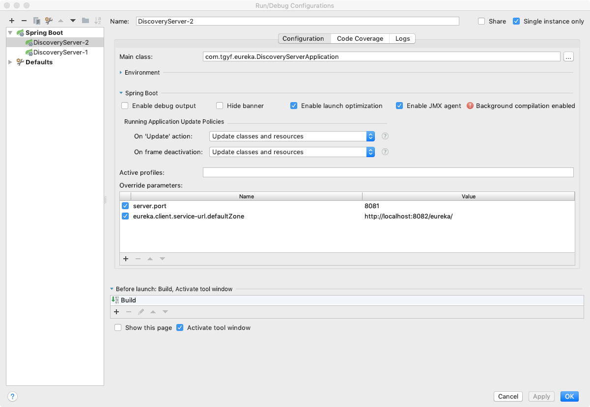

# 服务发现之Eureka/Ribbon
* 深度剖析服务发现组件~Netflix Eureka
    * [https://zhuanlan.zhihu.com/p/24829766](https://zhuanlan.zhihu.com/p/24829766)
* 深入理解Ribbon之源码解析
    * [https://blog.csdn.net/forezp/article/details/74820899](https://blog.csdn.net/forezp/article/details/74820899)
## (一)Spring Cloud Eureka服务端主要配置项

|配置参数(eureka.server.*)|默认值|说明|
|:-|:-|:-|
|enableSelfPreservation |true |启用注册中心的自保护机制，Eureka 如果统计到15分钟之内损失>15%的微服务心跳，则将会触发自保护机制，不再剔除服务提供者。|
|waitTimeInMsWhenSyncEmpty|1000 * 60 * 5|在Eureka服务器获取不到集群里对等服务器上的实例时，需要等待的时间，单位为毫秒，默认为1000 * 60 * 5。单机开发模式建议设置为0。|

## (二)Spring Cloud Eureka客户端主要配置项
|配置参数(eureka.client.*)|默认值|说明|
|:-|:-|:-|
|serviceUrl||指定服务注册中心地址，类型为 HashMap，并设置有一组默认值，默认的Key为defaultZone；默认的Value为 http://localhost:8761/eureka ，如果服务注册中心为高可用集群时，多个注册中心地址以逗号分隔。如果服务注册中心加入了安全验证，这里配置的地址格式为：http://<username>:<password>@localhost:8761/eureka 其中 <username>为安全校验的用户名；<password> 为该用户的密码|
|fetchRegistry|true|是否从Eureka服务端获取注册信息|
|registryFetchIntervalSeconds|30|从Eureka服务端获取注册信息的间隔时间，单位为秒|
|registerWithEureka|true|是否要将自身的实例信息注册到Eureka服务端 |

## (三)Spring Cloud Eureka实例主要配置项
|配置参数(eureka.instance.*)|默认值|说明|
|:-|:-|:-|
|leaseRenewalIntervalInSeconds|30|Eureka客户端向服务端发送心跳的时间间隔，单位为秒|
|leaseExpirationDurationInSeconds|90|Eureka服务端在收到最后一次心跳之后等待的过期时间上限，单位为秒。超过该时间没有收到心跳，则服务端会将该服务实例从服务清单中剔除，从而禁止服务调用请求被发送到该实例上|
|appname||服务名，默认取spring.application.name的配置值，如果没有则为unknown|
|hostname||主机名，不配置的时候将根据操作系统的主机名来获取|
|instance-id|主机名|注册到eureka的实例id，推荐${spring.cloud.client.ipaddress}:${spring.application.name}:${server.port}|

## (四)Spring Cloud Ribbon主要配置项
|配置参数({svc}.ribbon.*)|默认值|说明|
|:-|:-|:-|
|ConnectionTimeout              |1000ms|连接超时时间|
|ReadTimeout                    |1000ms|读取超时时间|
|ServerListRefreshInterval      |30秒|刷新服务列表源的间隔时间|
|NFLoadBalancerClassName        |com.netflix.loadbalancer.ZoneAwareLoadBalancer|定制ILoadBalancer实现|
|NFLoadBalancerRuleClassName    |com.netflix.loadbalancer.ZoneAvoidanceRule|定制IRule实现|
|NFLoadBalancerPingClassName    |com.netflix.loadbalancer.DummyPing|定制IPing|
|NIWSServerListClassName        |com.netflix.loadbalancer.ConfigurationBasedServerList|定制ServerList|
|ServerListUpdateClassName      |com.netflix.loadbalancer.PollingServerListUpdater|定制ServerListUpdater|
|NIWSServerListFilterClassName  |com.netflix.loadbalancer.ZonePreferenceServerListFilter|定制SeverListFilter|

## (五)Spring Cloud Eureka 自保护模式

翻墙查阅：[https://medium.com/@fahimfarookme/the-mystery-of-eureka-self-preservation-c7aa0ed1b799](https://medium.com/@fahimfarookme/the-mystery-of-eureka-self-preservation-c7aa0ed1b799)

## (六)健康检查和蓝绿发布

### 状态API例子：
    PUT /eureka/apps/{appId}/{instanceId}?status=UP
    PUT /eureka/apps/ORDER-SERVICE/localhost:order-service:8886?status=UP
    PUT /eureka/apps/{app id}/{instance id}/status?value={status}
    DELETE /eureka/apps/{app id}/{instance id}/status
    PUT /eureka/apps/ORDER-SERVICE/localhost:order-service:8886/status?value=OUT_OF_SERVICE
    
### HealthCheckHandler：
* 定制注册
    * EurekaClient#registerHealthCheck
* Spring Cloud
    * eureka.client.healthcheck.enabled=true
    * EurekaHealthCheckHandler
        * DiskSpaceHealthIndicator
        * RefreshScopeHealthIndicator
        * HystrixHealthIndicator
        
### Ribbon软负载实例信息更新延迟：

1. 注册延时（30秒）
2. Eureka服务器响应延迟（30秒）
3. Eureka客户端更新延迟（30秒）
4. Ribbon服务列表更新延迟（30秒）
* 最大可能有2分钟延迟

## 测试

配置服务启动端

第一次运行使用`8081`服务器端口

```
server.port=8081
eureka.client.service-url.defaultZone=http://localhost:8082/eureka/
```
第二次运行使用`8082`服务器端口
```
server.port=8082
eureka.client.service-url.defaultZone=http://localhost:8081/eureka/
```

UI校验：

```
http://localhost:8081/
http://localhost:8082/
```

API校验：

```
http://localhost:8081/eureka/apps
http://localhost:8082/eureka/apps
```