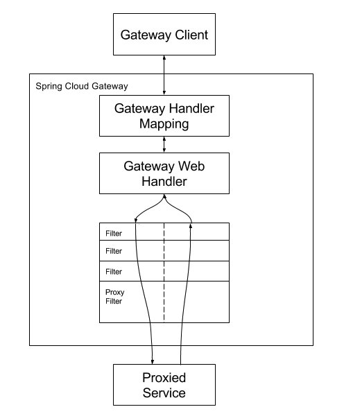
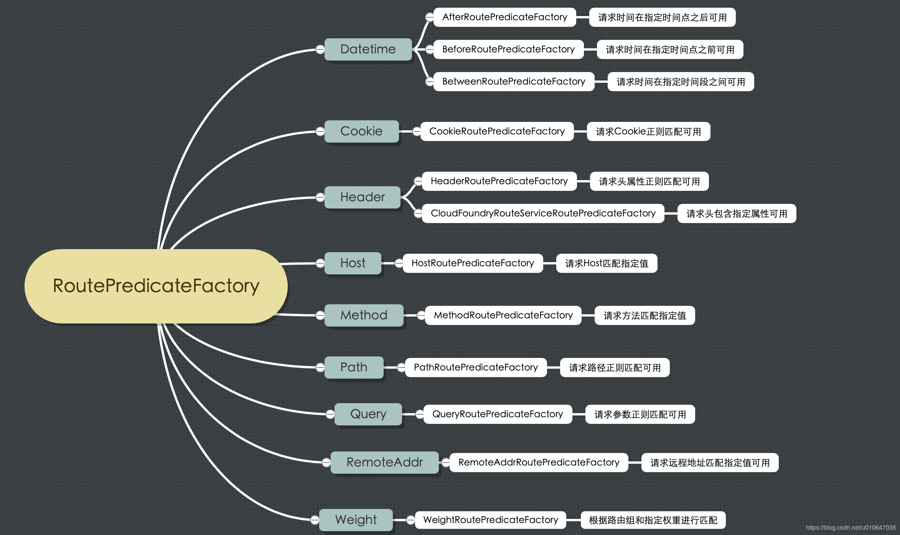

# Spring Cloud Gateway

* Gateway是spring cloud 推出的新的网关路由，它关注于安全性，网关路由，限流控制等，是第二代网关路由器。
* Spring Cloud Gateway使用的是Spring Boot和Spring Webflux提供的Netty底层环境，不能和传统的Servlet容器一起使用，也不能打包成一个WAR包。
* 引入了依赖默认即开启gateway了，如果暂时不想使用这个功能，这可以配置spring.cloud.gateway.enabled=false即可。
```
<dependency>
	<groupId>org.springframework.cloud</groupId>
	<artifactId>spring-cloud-starter-gateway</artifactId>
</dependency>
```
## (一)工作原理
* 当客户端发送请求到Spring Cloud Gateway，Gateway Handler Mapping会匹配Route映射分发到Gateway Web Handler。handler会将请求经过一系列的filter处理，代理请求前，会执行左右的”pre” filter逻辑，代理请求后，会执行所有”post” filter逻辑。


## (二)谓词工厂
建议仔细阅读:
[官方文档1](https://cloud.spring.io/spring-cloud-static/Greenwich.SR2/single/spring-cloud.html#gateway-request-predicates-factories)
[官方文档2](https://cloud.spring.io/spring-cloud-gateway/reference/html/#gateway-request-predicates-factories)


### 2.1 Datetime
接受一个时间参数，满足时间条件后路由
* 技巧：时间可使用 System.out.println(ZonedDateTime.now()); 打印，然后即可看到时区。例如：2019-09-29T16:50:42.579+08:00[Asia/Shanghai]
* 时间格式的相关逻辑：
    * 默认时间格式：org.springframework.format.support.DefaultFormattingConversionService#addDefaultFormatters
    * 时间格式注册：org.springframework.format.datetime.standard.DateTimeFormatterRegistrar#regi
    
Before Route Predicate Factory:使用时间作为匹配规则，只要当前时间小于设定时间，路由才会匹配请求。
* id:表示路由名称
* uri:路由转发的地址
* predicates:断言规则
* Before:表示当前时间小于设定时间
```
spring:
     cloud:
       gateway:
         routes:
           - id: before_route
             uri: lb://user-center
             predicates:
               # 当且仅当请求时的时间Before配置的时间时，才会转发到用户微服务
               # 目前配置不会进该路由配置，所以返回404
               # 将时间改成 > now的时间，则访问localhost:8040/** -> user-center/**
               # eg. 访问http://localhost:8040/users/1 -> user-center/users/1
               - Before=2019-09-30T17:42:47.789-07:00[America/Denver]
 ```
 
 After Route Predicate Factory:使用的是时间作为匹配规则，只要当前时间大于设定时间，路由才会匹配请求
 * id:表示路由名称
 * uri:路由转发的地址
 * predicates:断言规则
 * After:表示大于设定时间
 
 ```
spring:
  cloud:
    gateway:
      routes:
        - id: after_route
          uri: lb://user-center
          predicates:
            # 当且仅当请求时的时间After配置的时间时，才会转发到用户微服务
            # 目前配置不会进该路由配置，所以返回404
            # 将时间改成 < now的时间，则访问localhost:8040/** -> user-center/**
            # eg. 访问http://localhost:8040/users/1 -> user-center/users/1
            - After=2030-01-20T17:42:47.789-07:00[America/Denver]

```
Between Route Predicate Factory:使用两个时间作为匹配规则，只要当前时间大于第一个设定时间，并小于第二个设定时间，路由才会匹配请求。
* id:表示路由名称
* uri:路由转发的地址
* predicates:断言规则
* Between:表示大于第一个设定时间并小于第二个设定时间
```
spring:
  cloud:
    gateway:
      routes:
        - id: between_route
          uri: lb://user-center
          predicates:
            # 当且仅当请求时的时间Between配置的时间时，才会转发到用户微服务
            # 因此，访问localhost:8040/** -> user-center/**
            # eg. 访问http://localhost:8040/users/1 -> user-center/users/1
            - Between=2019-01-20T17:42:47.789-07:00[America/Denver], 2027-01-21T17:42:47.789-07:00[America/Denver]

```
### 2.2 Cookie
Cookie Route Predicate Factory:使用的是cookie名字和正则表达式的value作为两个输入参数，请求的cookie需要匹配cookie名和符合其中value的正则。
```
spring:
  cloud:
    gateway:
      routes:
        - id: cookie_route
          uri: lb://user-center
          predicates:
            # 当且仅当带有名为somecookie，并且值符合正则ch.p的Cookie时，才会转发到用户微服务
            # 如Cookie满足条件，则访问http://localhost:8040/** -> user-center/**
            # eg. 访问http://localhost:8040/users/1 -> user-center/users/1
            - Cookie=somecookie, ch.p

```

### 2.3 Header
Header Route Predicate Factory:使用的是两个参数，一个header的name，一个是正则匹配的value。
* 请求头 header中带 X-Request-Id，且值为数字，允许路由。
```
spring:
  cloud:
    gateway:
      routes:
        - id: header_route
          uri: lb://user-center
          predicates:
            # 当且仅当带有名为X-Request-Id，并且值符合正则\d+的Header时，才会转发到用户微服务
            # 如Header满足条件，则访问http://localhost:8040/** -> user-center/**
            # eg. 访问http://localhost:8040/users/1 -> user-center/users/1
            - Header=X-Request-Id, \d+
```
### 2.4 Host
```
spring:
  cloud:
    gateway:
      routes:
        - id: host_route
          uri: lb://user-center
          predicates:
            # 当且仅当名为Host的Header符合**.somehost.org或**.anotherhost.org时，才会转发用户微服务
            # 如Host满足条件，则访问http://localhost:8040/** -> user-center/**
            # eg. 访问http://localhost:8040/users/1 -> user-center/users/1
            - Host=**.somehost.org,**.anotherhost.org
```
### 2.5 Method
```
spring:
  cloud:
    gateway:
      routes:
        - id: method_route
          uri: lb://user-center
          predicates:
            # 当且仅当HTTP请求方法是GET时，才会转发用户微服务
            # 如请求方法满足条件，访问http://localhost:8040/** -> user-center/**
            # eg. 访问http://localhost:8040/users/1 -> user-center/users/1
            - Method=GET
```
### 2.6 Path
* 官方文档：[segment小技巧](https://cloud.spring.io/spring-cloud-gateway/reference/html/#path-route-predicate-factory)
```
spring:
  cloud:
    gateway:
      routes:
        - id: path_route
          uri: lb://user-center
          predicates:
            # 当且仅当访问路径是/users/*或者/some-path/**，才会转发用户微服务
            # segment是一个特殊的占位符，单层路径匹配
            # eg. 访问http://localhost:8040/users/1 -> user-center/users/1
            - Path=/users/{segment},/some-path/**
```
### 2.7 Query
示例1：
```
spring:
  cloud:
    gateway:
      routes:
        - id: query_route
          uri: lb://user-center
          predicates:
            # 当且仅当请求带有baz的参数，才会转发到用户微服务
            # eg. 访问http://localhost:8040/users/1?baz=xx -> user-center的/users/1
            - Query=baz
```
示例2：
```
spring:
  cloud:
    gateway:
      routes:
        - id: query_route
          uri: lb://user-center
          predicates:
            # 当且仅当请求带有名为foo的参数，且参数值符合正则ba.，才会转发到用户微服务
            # eg. 访问http://localhost:8040/users/1?baz=baz -> user-center的/users/1?baz=baz
            - Query=foo, ba.
```

### 2.8 RemoteAddr
* 官方文档：[代理的ip小技巧](https://cloud.spring.io/spring-cloud-gateway/reference/html/#modifying-the-way-remote-addresses-are-resolved)
* XForwardedRemoteAddressResolver::trustAll得到的RemoteAddressResolver总是获取X-Forwarded-For的第一个ip地址作为remote address，这种方式就比较容易被伪装的请求欺骗，模拟请求很容易通过设置初始的X-Forwarded-For头信息，就可以欺骗到gateway。
* XForwardedRemoteAddressResolver::maxTrustedIndex得到的RemoteAddressResolver则会在X-Forwarded-For信息里面，从右到左选择信任最多maxTrustedIndex个ip，因为X-Forwarded-For是越往右是越接近gateway的代理机器ip，所以是越往右的ip，信任度是越高的。
那么如果前面只是挡了一层Nginx的话，如果只需要Nginx前面客户端的ip，则maxTrustedIndex取1，就可以比较安全地获取真实客户端ip。
```
spring:
  cloud:
    gateway:
      routes:
        - id: remoteaddr_route
          uri: lb://user-center
          predicates:
            # 当且仅当请求IP是192.168.1.1/24网段，例如192.168.1.10，才会转发到用户微服务
            # eg. 访问http://localhost:8040/users/1 -> user-center的/users/1
            - RemoteAddr=192.168.1.1/24
```
### 2.9 Weigth
Weight Route Predicate Factory:
```

```

## (二)过滤器工厂
* Route Predicate 决定路由到哪个路径，那么过滤器就是允许修改HTTP请求的一些属性。spring cloud 内置了一部分过滤器，也可以自定义过滤器
### 3.1. AddRequestHeader GatewayFilter Factory
### 3.2. AddRequestParameter GatewayFilter Factory
### 3.3. AddResponseHeader GatewayFilter Factory
### 3.4. DedupeResponseHeader GatewayFilter Factory
### 3.5. Hystrix GatewayFilter Factory
### 3.6. FallbackHeaders GatewayFilter Factory
### 3.7. MapRequestHeader GatewayFilter Factory
### 3.8. PrefixPath GatewayFilter Factory
### 3.9. PreserveHostHeader GatewayFilter Factory
### 3.10. RequestRateLimiter GatewayFilter Factory
### 3.11. RedirectTo GatewayFilter Factory
### 3.12. RemoveHopByHopHeadersFilter GatewayFilter Factory
### 3.13. RemoveRequestHeader GatewayFilter Factory
### 3.14. RemoveResponseHeader GatewayFilter Factory
### 3.15. RemoveRequestParameter GatewayFilter Factory
### 3.16. RewritePath GatewayFilter Factory
### 3.17. RewriteLocationResponseHeader GatewayFilter Factory
### 3.18. RewriteResponseHeader GatewayFilter Factory
### 3.19. SaveSession GatewayFilter Factory
### 3.20. SecureHeaders GatewayFilter Factory
### 3.21. SetPath GatewayFilter Factory
### 3.22. SetRequestHeader GatewayFilter Factory
### 3.23. SetResponseHeader GatewayFilter Factory
### 3.24. SetStatus GatewayFilter Factory
### 3.25. StripPrefix GatewayFilter Factory
### 3.26. Retry GatewayFilter Factory
### 3.27. RequestSize GatewayFilter Factory
### 3.28. Modify Request Body GatewayFilter Factory
### 3.29. Modify Response Body GatewayFilter Factory
### 3.30. Default Filters