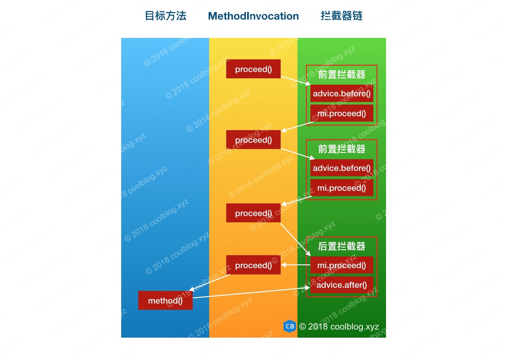
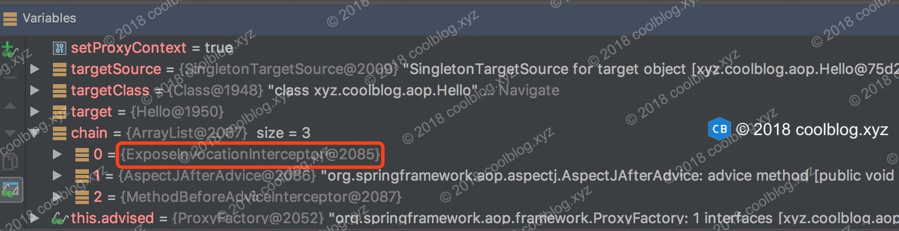

## 1.简介

本篇文章是 AOP 源码分析系列文章的最后一篇文章，在前面的两篇文章中，我分别介绍了 Spring AOP 是如何为目标 bean 筛选合适的通知器，以及如何创建代理对象的过程。现在我们的得到了 bean 的代理对象，且通知也以合适的方式插在了目标方法的前后。接下来要做的事情，就是执行通知逻辑了。通知可能在目标方法前执行，也可能在目标方法后执行。具体的执行时机，取决于用户的配置。当目标方法被多个通知匹配到时，Spring 通过引入拦截器链来保证每个通知的正常执行。在本文中，我们将会通过源码了解到 Spring 是如何支持 expose-proxy 属性的，以及通知与拦截器之间的关系，拦截器链的执行过程等。在进行源码分析前，我们先来了解一些背景知识。好了，下面进入正题吧。

## 2.背景知识

关于 expose-proxy，我们先来说说它有什么用，然后再来说说怎么用。Spring 引入 expose-proxy 特性是为了解决**目标方法调用同对象中其他方法时，其他方法的切面逻辑无法执行的问题**。这个解释可能不好理解，不直观。那下面我来演示一下它的用法，大家就知道是怎么回事了。我们先来看看 expose-proxy 是怎样配置的，如下：

    <bean id="hello" class="xyz.coolblog.aop.Hello"/>  
    <bean id="aopCode" class="xyz.coolblog.aop.AopCode"/>  

    <aop:aspectj-autoproxy expose-proxy="true" />  

    <aop:config expose-proxy="true">  
        <aop:aspect id="myaspect" ref="aopCode">  
            <aop:pointcut id="helloPointcut" expression="execution(* xyz.coolblog.aop.*.hello*(..))" />  
            <aop:before method="before" pointcut-ref="helloPointcut" />  
        </aop:aspect>  
    </aop:config>  

如上，expose-proxy 可配置在 `<aop:config/>` 和 `<aop:aspectj-autoproxy />` 标签上。在使用 expose-proxy 时，需要对内部调用进行改造，比如：

    public class Hello implements IHello {  

        @Override  
        public void hello() {  
            System.out.println("hello");  
            this.hello("world");  
        }  

        @Override  
        public void hello(String hello) {  
            System.out.println("hello " +  hello);  
        }  
    }  

`hello()`方法调用了同类中的另一个方法`hello(String)`，此时`hello(String)`上的切面逻辑就无法执行了。这里，我们要对`hello()`方法进行改造，强制它调用代理对象中的`hello(String)`。改造结果如下：

    public class Hello implements IHello {  

        @Override  
        public void hello() {  
            System.out.println("hello");  
            ((IHello) AopContext.currentProxy()).hello("world");  
        }  

        @Override  
        public void hello(String hello) {  
            System.out.println("hello " +  hello);  
        }  
    }  

如上，`AopContext.currentProxy()`用于获取当前的代理对象。当 expose-proxy 被配置为 true 时，该代理对象会被放入 ThreadLocal 中。关于 expose-proxy，这里先说这么多，后面分析源码时会再次提及。

## 3.源码分析

本章所分析的源码来自 JdkDynamicAopProxy，至于 CglibAopProxy 中的源码，大家若有兴趣可以自己去看一下。

### 3.1 JDK 动态代理逻辑分析

本节，我来分析一下 JDK 动态代理逻辑。对于 JDK 动态代理，代理逻辑封装在 InvocationHandler 接口实现类的 invoke 方法中。JdkDynamicAopProxy 实现了 InvocationHandler 接口，下面我们就来分析一下 JdkDynamicAopProxy 的 invoke 方法。如下：

    public Object invoke(Object proxy, Method method, Object[] args) throws Throwable {  
        MethodInvocation invocation;  
        Object oldProxy = null;  
        boolean setProxyContext = false;  

        TargetSource targetSource = this.advised.targetSource;  
        Class<?> targetClass = null;  
        Object target = null;  

        try {  
            // 省略部分代码  
            Object retVal;  

            // 如果 expose-proxy 属性为 true，则暴露代理对象  
            if (this.advised.exposeProxy) {  
                // 向 AopContext 中设置代理对象  
                oldProxy = AopContext.setCurrentProxy(proxy);  
                setProxyContext = true;  
            }  

            // 获取适合当前方法的拦截器  
            List<Object> chain = this.advised.getInterceptorsAndDynamicInterceptionAdvice(method, targetClass);  

            // 如果拦截器链为空，则直接执行目标方法  
            if (chain.isEmpty()) {  
                Object[] argsToUse = AopProxyUtils.adaptArgumentsIfNecessary(method, args);  
                // 通过反射执行目标方法  
                retVal = AopUtils.invokeJoinpointUsingReflection(target, method, argsToUse);  
            }  
            else {  
                // 创建一个方法调用器，并将拦截器链传入其中  
                invocation = new ReflectiveMethodInvocation(proxy, target, method, args, targetClass, chain);  
                // 执行拦截器链  
                retVal = invocation.proceed();  
            }  

            // 获取方法返回值类型  
            Class<?> returnType = method.getReturnType();  
            if (retVal != null && retVal == target &&  
                    returnType != Object.class && returnType.isInstance(proxy) &&  
                    !RawTargetAccess.class.isAssignableFrom(method.getDeclaringClass())) {  
                // 如果方法返回值为 this，即 return this; 则将代理对象 proxy 赋值给 retVal   
                retVal = proxy;  
            }  
            // 如果返回值类型为基础类型，比如 int，long 等，当返回值为 null，抛出异常  
            else if (retVal == null && returnType != Void.TYPE && returnType.isPrimitive()) {  
                throw new AopInvocationException(  
                        "Null return value from advice does not match primitive return type for: " + method);  
            }  
            return retVal;  
        }  
        finally {  
            if (target != null && !targetSource.isStatic()) {  
                targetSource.releaseTarget(target);  
            }  
            if (setProxyContext) {  
                AopContext.setCurrentProxy(oldProxy);  
            }  
        }  
    }  

如上，上面的代码我做了比较详细的注释。下面我们来总结一下 invoke 方法的执行流程，如下：

1.  检测 expose-proxy 是否为 true，若为 true，则暴露代理对象
2.  获取适合当前方法的拦截器
3.  如果拦截器链为空，则直接通过反射执行目标方法
4.  若拦截器链不为空，则创建方法调用 ReflectiveMethodInvocation 对象
5.  调用 ReflectiveMethodInvocation 对象的 proceed() 方法启动拦截器链
6.  处理返回值，并返回该值

在以上6步中，我们重点关注第2步和第5步中的逻辑。第2步用于获取拦截器链，第5步则是启动拦截器链。下面先来分析获取拦截器链的过程。

### 3.2 获取所有的拦截器

所谓的拦截器，顾名思义，是指用于对目标方法的调用进行拦截的一种工具。拦截器的源码比较简单，所以我们直接看源码好了。下面以前置通知拦截器为例，如下：

    public class MethodBeforeAdviceInterceptor implements MethodInterceptor, Serializable {  

        /** 前置通知 */  
        private MethodBeforeAdvice advice;  

        public MethodBeforeAdviceInterceptor(MethodBeforeAdvice advice) {  
            Assert.notNull(advice, "Advice must not be null");  
            this.advice = advice;  
        }  

        @Override  
        public Object invoke(MethodInvocation mi) throws Throwable {  
            // 执行前置通知逻辑  
            this.advice.before(mi.getMethod(), mi.getArguments(), mi.getThis());  
            // 通过 MethodInvocation 调用下一个拦截器，若所有拦截器均执行完，则调用目标方法  
            return mi.proceed();  
        }  
    }  

如上，前置通知的逻辑在目标方法执行前被执行。这里先简单向大家介绍一下拦截器是什么，关于拦截器更多的描述将放在下一节中。本节我们先来看看如何如何获取拦截器，如下：

    public List<Object> getInterceptorsAndDynamicInterceptionAdvice(Method method, Class<?> targetClass) {  
        MethodCacheKey cacheKey = new MethodCacheKey(method);  
        // 从缓存中获取  
        List<Object> cached = this.methodCache.get(cacheKey);  
        // 缓存未命中，则进行下一步处理  
        if (cached == null) {  
            // 获取所有的拦截器  
            cached = this.advisorChainFactory.getInterceptorsAndDynamicInterceptionAdvice(  
                    this, method, targetClass);  
            // 存入缓存  
            this.methodCache.put(cacheKey, cached);  
        }  
        return cached;  
    }  

    public List<Object> getInterceptorsAndDynamicInterceptionAdvice(  
            Advised config, Method method, Class<?> targetClass) {  

        List<Object> interceptorList = new ArrayList<Object>(config.getAdvisors().length);  
        Class<?> actualClass = (targetClass != null ? targetClass : method.getDeclaringClass());  
        boolean hasIntroductions = hasMatchingIntroductions(config, actualClass);  
        // registry 为 DefaultAdvisorAdapterRegistry 类型  
        AdvisorAdapterRegistry registry = GlobalAdvisorAdapterRegistry.getInstance();  

        // 遍历通知器列表  
        for (Advisor advisor : config.getAdvisors()) {  
            if (advisor instanceof PointcutAdvisor) {  
                PointcutAdvisor pointcutAdvisor = (PointcutAdvisor) advisor;  
                /*  
                 \* 调用 ClassFilter 对 bean 类型进行匹配，无法匹配则说明当前通知器  
                 \* 不适合应用在当前 bean 上  
                 \*/  
                if (config.isPreFiltered() || pointcutAdvisor.getPointcut().getClassFilter().matches(actualClass)) {  
                    // 将 advisor 中的 advice 转成相应的拦截器  
                    MethodInterceptor[] interceptors = registry.getInterceptors(advisor);  
                    MethodMatcher mm = pointcutAdvisor.getPointcut().getMethodMatcher();  
                    // 通过方法匹配器对目标方法进行匹配  
                    if (MethodMatchers.matches(mm, method, actualClass, hasIntroductions)) {  
                        // 若 isRuntime 返回 true，则表明 MethodMatcher 要在运行时做一些检测  
                        if (mm.isRuntime()) {  
                            for (MethodInterceptor interceptor : interceptors) {  
                                interceptorList.add(new InterceptorAndDynamicMethodMatcher(interceptor, mm));  
                            }  
                        }  
                        else {  
                            interceptorList.addAll(Arrays.asList(interceptors));  
                        }  
                    }  
                }  
            }  
            else if (advisor instanceof IntroductionAdvisor) {  
                IntroductionAdvisor ia = (IntroductionAdvisor) advisor;  
                // IntroductionAdvisor 类型的通知器，仅需进行类级别的匹配即可  
                if (config.isPreFiltered() || ia.getClassFilter().matches(actualClass)) {  
                    Interceptor[] interceptors = registry.getInterceptors(advisor);  
                    interceptorList.addAll(Arrays.asList(interceptors));  
                }  
            }  
            else {  
                Interceptor[] interceptors = registry.getInterceptors(advisor);  
                interceptorList.addAll(Arrays.asList(interceptors));  
            }  
        }  

        return interceptorList;  
    }  

    public MethodInterceptor[] getInterceptors(Advisor advisor) throws UnknownAdviceTypeException {  
        List<MethodInterceptor> interceptors = new ArrayList<MethodInterceptor>(3);  
        Advice advice = advisor.getAdvice();  
        /*  
         \* 若 advice 是 MethodInterceptor 类型的，直接添加到 interceptors 中即可。  
         \* 比如 AspectJAfterAdvice 就实现了 MethodInterceptor 接口  
         \*/  
        if (advice instanceof MethodInterceptor) {  
            interceptors.add((MethodInterceptor) advice);  
        }  

        /*  
         \* 对于 AspectJMethodBeforeAdvice 等类型的通知，由于没有实现 MethodInterceptor   
         \* 接口，所以这里需要通过适配器进行转换  
         \*/   
        for (AdvisorAdapter adapter : this.adapters) {  
            if (adapter.supportsAdvice(advice)) {  
                interceptors.add(adapter.getInterceptor(advisor));  
            }  
        }  
        if (interceptors.isEmpty()) {  
            throw new UnknownAdviceTypeException(advisor.getAdvice());  
        }  
        return interceptors.toArray(new MethodInterceptor[interceptors.size()]);  
    }  

以上就是获取拦截器的过程，代码有点长，不过好在逻辑不是很复杂。这里简单总结一下以上源码的执行过程，如下：

1.  从缓存中获取当前方法的拦截器链
2.  若缓存未命中，则调用 getInterceptorsAndDynamicInterceptionAdvice 获取拦截器链
3.  遍历通知器列表
4.  对于 PointcutAdvisor 类型的通知器，这里要调用通知器所持有的切点（Pointcut）对类和方法进行匹配，匹配成功说明应向当前方法织入通知逻辑
5.  调用 getInterceptors 方法对非 MethodInterceptor 类型的通知进行转换
6.  返回拦截器数组，并在随后存入缓存中

这里需要说明一下，部分通知器是没有实现 MethodInterceptor 接口的，比如 AspectJMethodBeforeAdvice。我们可以看一下前置通知适配器是如何将前置通知转为拦截器的，如下：

    class MethodBeforeAdviceAdapter implements AdvisorAdapter, Serializable {  

        @Override  
        public boolean supportsAdvice(Advice advice) {  
            return (advice instanceof MethodBeforeAdvice);  
        }  

        @Override  
        public MethodInterceptor getInterceptor(Advisor advisor) {  
            MethodBeforeAdvice advice = (MethodBeforeAdvice) advisor.getAdvice();  
            // 创建 MethodBeforeAdviceInterceptor 拦截器  
            return new MethodBeforeAdviceInterceptor(advice);  
        }  
    }  

如上，适配器的逻辑比较简单，这里就不多说了。

现在我们已经获得了拦截器链，那接下来要做的事情就是启动拦截器了。所以接下来，我们一起去看看 Sring 是如何让拦截器链运行起来的。

### 3.3 启动拦截器链

#### 3.3.1 执行拦截器链

本节的开始，我们先来说说 ReflectiveMethodInvocation。ReflectiveMethodInvocation 贯穿于拦截器链执行的始终，可以说是核心。该类的 proceed 方法用于启动启动拦截器链，下面我们去看看这个方法的逻辑。

    public class ReflectiveMethodInvocation implements ProxyMethodInvocation {  

        private int currentInterceptorIndex = -1;  

        public Object proceed() throws Throwable {  
            // 拦截器链中的最后一个拦截器执行完后，即可执行目标方法  
            if (this.currentInterceptorIndex == this.interceptorsAndDynamicMethodMatchers.size() - 1) {  
                // 执行目标方法  
                return invokeJoinpoint();  
            }  

            Object interceptorOrInterceptionAdvice =  
                    this.interceptorsAndDynamicMethodMatchers.get(++this.currentInterceptorIndex);  
            if (interceptorOrInterceptionAdvice instanceof InterceptorAndDynamicMethodMatcher) {  
                InterceptorAndDynamicMethodMatcher dm =  
                        (InterceptorAndDynamicMethodMatcher) interceptorOrInterceptionAdvice;  
                /*  
                 \* 调用具有三个参数（3-args）的 matches 方法动态匹配目标方法，  
                 \* 两个参数（2-args）的 matches 方法用于静态匹配  
                 \*/  
                if (dm.methodMatcher.matches(this.method, this.targetClass, this.arguments)) {  
                    // 调用拦截器逻辑  
                    return dm.interceptor.invoke(this);  
                }  
                else {  
                    // 如果匹配失败，则忽略当前的拦截器  
                    return proceed();  
                }  
            }  
            else {  
                // 调用拦截器逻辑，并传递 ReflectiveMethodInvocation 对象  
                return ((MethodInterceptor) interceptorOrInterceptionAdvice).invoke(this);  
            }  
        }  
    }  

如上，proceed 根据 currentInterceptorIndex 来确定当前应执行哪个拦截器，并在调用拦截器的 invoke 方法时，将自己作为参数传给该方法。前面的章节中，我们看过了前置拦截器的源码，这里来看一下后置拦截器源码。如下：

    public class AspectJAfterAdvice extends AbstractAspectJAdvice  
            implements MethodInterceptor, AfterAdvice, Serializable {  

        public AspectJAfterAdvice(  
                Method aspectJBeforeAdviceMethod, AspectJExpressionPointcut pointcut, AspectInstanceFactory aif) {  

            super(aspectJBeforeAdviceMethod, pointcut, aif);  
        }  

        @Override  
        public Object invoke(MethodInvocation mi) throws Throwable {  
            try {  
                // 调用 proceed  
                return mi.proceed();  
            }  
            finally {  
                // 调用后置通知逻辑  
                invokeAdviceMethod(getJoinPointMatch(), null, null);  
            }  
        }  

        //...  
    }  

如上，由于后置通知需要在目标方法返回后执行，所以 AspectJAfterAdvice 先调用 mi.proceed() 执行下一个拦截器逻辑，等下一个拦截器返回后，再执行后置通知逻辑。如果大家不太理解的话，先看个图。这里假设目标方法 method 在执行前，需要执行两个前置通知和一个后置通知。下面我们看一下由三个拦截器组成的拦截器链是如何执行的，如下：

  
注：这里用 advice.after() 表示执行后置通知

本节的最后，插播一个拦截器，即 ExposeInvocationInterceptor。为啥要在这里介绍这个拦截器呢，原因是我在[Spring AOP 源码分析 - 筛选合适的通知器](http://www.coolblog.xyz/2018/06/20/Spring-AOP-%E6%BA%90%E7%A0%81%E5%88%86%E6%9E%90-%E7%AD%9B%E9%80%89%E5%90%88%E9%80%82%E7%9A%84%E9%80%9A%E7%9F%A5%E5%99%A8/)一文中，在介绍 extendAdvisors 方法时，有一个点没有详细说明。现在大家已经知道拦截器的概念了，就可以把之前没法详细说明的地方进行补充说明。这里再贴一下 extendAdvisors 方法的源码，如下：

    protected void extendAdvisors(List<Advisor> candidateAdvisors) {  
        AspectJProxyUtils.makeAdvisorChainAspectJCapableIfNecessary(candidateAdvisors);  
    }  

    public static boolean makeAdvisorChainAspectJCapableIfNecessary(List<Advisor> advisors) {  
        if (!advisors.isEmpty()) {  
            // 省略部分代码  

            if (foundAspectJAdvice && !advisors.contains(ExposeInvocationInterceptor.ADVISOR)) {  
                // 向通知器列表中添加 ExposeInvocationInterceptor.ADVISOR  
                advisors.add(0, ExposeInvocationInterceptor.ADVISOR);  
                return true;  
            }  
        }  
        return false;  
    }  

如上，extendAdvisors 所调用的方法会向通知器列表首部添加 ExposeInvocationInterceptor.ADVISOR。现在我们再来看看 ExposeInvocationInterceptor 的源码，如下：

    public class ExposeInvocationInterceptor implements MethodInterceptor, PriorityOrdered, Serializable {  

        public static final ExposeInvocationInterceptor INSTANCE = new ExposeInvocationInterceptor();  

        // 创建 DefaultPointcutAdvisor 匿名对象  
        public static final Advisor ADVISOR = new DefaultPointcutAdvisor(INSTANCE) {  
            @Override  
            public String toString() {  
                return ExposeInvocationInterceptor.class.getName() +".ADVISOR";  
            }  
        };  

        private static final ThreadLocal<MethodInvocation> invocation =  
                new NamedThreadLocal<MethodInvocation>("Current AOP method invocation");  

        public static MethodInvocation currentInvocation() throws IllegalStateException {  
            MethodInvocation mi = invocation.get();  
            if (mi == null)  
                throw new IllegalStateException(  
                        "No MethodInvocation found: Check that an AOP invocation is in progress, and that the " +  
                        "ExposeInvocationInterceptor is upfront in the interceptor chain. Specifically, note that " +  
                        "advices with order HIGHEST_PRECEDENCE will execute before ExposeInvocationInterceptor!");  
            return mi;  
        }  

        // 私有构造方法  
        private ExposeInvocationInterceptor() {  
        }  

        @Override  
        public Object invoke(MethodInvocation mi) throws Throwable {  
            MethodInvocation oldInvocation = invocation.get();  
            // 将 mi 设置到 ThreadLocal 中  
            invocation.set(mi);  
            try {  
                // 调用下一个拦截器  
                return mi.proceed();  
            }  
            finally {  
                invocation.set(oldInvocation);  
            }  
        }  

        //...  
    }  
 

如上，ExposeInvocationInterceptor.ADVISOR 经过 registry.getInterceptors 方法（前面已分析过）处理后，即可得到 ExposeInvocationInterceptor。ExposeInvocationInterceptor 的作用是用于暴露 MethodInvocation 对象到 ThreadLocal 中，其名字也体现出了这一点。如果其他地方需要当前的 MethodInvocation 对象，直接通过调用 currentInvocation 方法取出。至于哪些地方需要 MethodInvocation，这个大家自己去探索吧。最后，建议大家写点代码调试一下。我在一开始阅读代码时，并没有注意到 ExposeInvocationInterceptor，而是在调试代码的过程中才发现的。比如：

好了，关于拦截器链的执行过程这里就讲完了。下一节，我们来看一下目标方法的执行过程。大家再忍忍，源码很快分析完了。

#### 3.3.2 执行目标方法

与前面的大部头相比，本节的源码比较短，也很简单。本节我们来看一下目标方法的执行过程，如下：

    protected Object invokeJoinpoint() throws Throwable {  
        return AopUtils.invokeJoinpointUsingReflection(this.target, this.method, this.arguments);  
    }  

    public abstract class AopUtils {  
        public static Object invokeJoinpointUsingReflection(Object target, Method method, Object[] args)  
                throws Throwable {  

            try {  
                ReflectionUtils.makeAccessible(method);  
                // 通过反射执行目标方法  
                return method.invoke(target, args);  
            }  
            catch (InvocationTargetException ex) {...}  
            catch (IllegalArgumentException ex) {...}  
            catch (IllegalAccessException ex) {...}  
        }  
    }  
    

目标方法时通过反射执行的，比较简单的吧。好了，就不多说了，over。

## 4.总结

到此，本篇文章的就要结束了。本篇文章是[Spring AOP 源码分析系列文章](http://www.coolblog.xyz/2018/06/17/Spring-AOP-%E6%BA%90%E7%A0%81%E5%88%86%E6%9E%90%E7%B3%BB%E5%88%97%E6%96%87%E7%AB%A0%E5%AF%BC%E8%AF%BB/)的最后一篇，从阅读源码到写完本系列的4篇文章总共花了约两周的时间。总的来说还是有点累的，但是也有很大的收获和成就感，值了。需要说明的是，Spring IOC 和 AOP 部分的源码我分析的并不是非常详细，也有很多地方没弄懂。这一系列的文章，是作为自己工作两年的一个总结。由于工作时间不长，工作经验和技术水平目前都还处于入门阶段。所以暂时很难把 Spring IOC 和 AOP 模块的源码分析的很出彩，这个请见谅。如果大家在阅读文章的过程中发现了错误，可以指出来，也希望多多指教，这里先说说谢谢。

好了，本篇文章到这里就结束了。谢谢大家的阅读。

##  参考

* [《Spring 源码深度解析》- 郝佳](https://book.douban.com/subject/25866350/)