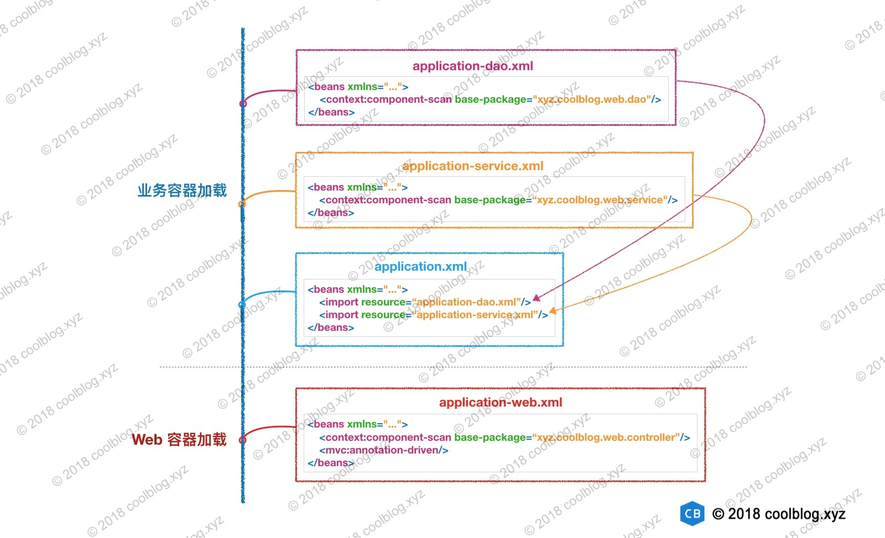

## 1.简介

一般情况下，我们会在一个 Web 应用中配置两个容器。一个容器用于加载 Web 层的类，比如我们的接口 Controller、HandlerMapping、ViewResolver 等。在本文中，我们把这个容器叫做 web 容器。另一个容器用于加载业务逻辑相关的类，比如 service、dao 层的一些类。在本文中，我们把这个容器叫做业务容器。在容器初始化的过程中，业务容器会先于 web 容器进行初始化。web 容器初始化时，会将业务容器作为父容器。这样做的原因是，web 容器中的一些 bean 会依赖于业务容器中的 bean。比如我们的 controller 层接口通常会依赖 service 层的业务逻辑类。下面举个例子进行说明：

如上，我们将 dao 层的类配置在 application-dao.xml 文件中，将 service 层的类配置在 application-service.xml 文件中。然后我们将这两个配置文件通过
<import>标签导入到 application.xml 文件中。此时，我们可以让业务容器去加载 application.xml 配置文件即可。另一方面，我们将 Web 相关的配置放在 application-web.xml 文件中，并将该文件交给 Web 容器去加载。</import>

这里我们把配置文件进行分层，结构上看起来清晰了很多，也便于维护。这个其实和代码分层是一个道理，如果我们把所有的代码都放在同一个包下，那看起来会多难受啊。同理，我们用业务容器和 Web 容器去加载不同的类也是一种分层的体现吧。当然，如果应用比较简单，仅用 Web 容器去加载所有的类也不是不可以。

### 2.1 业务容器的创建过程

前面说了一些背景知识作为铺垫，那下面我们开始分析容器的创建过程吧。按照创建顺序，我们先来分析业务容器的创建过程。业务容器的创建入口是 ContextLoaderListener 的 contextInitialized 方法。顾名思义，ContextLoaderListener 是用来监听 ServletContext 加载事件的。当 ServletContext 被加载后，监听器的 contextInitialized 方法就会被 Servlet 容器调用。ContextLoaderListener Spring 框架提供的，它的配置方法如下：

    <web-app>  
        <listener>  
            <listener-class>org.springframework.web.context.ContextLoaderListener</listener-class>  
        </listener>  

        <context-param>  
            <param-name>contextConfigLocation</param-name>  
            <param-value>classpath:application.xml</param-value>  
        </context-param>  

        <!-- 省略其他配置 -->  
    </web-app>  

如上，ContextLoaderListener 可通过 ServletContext 获取到 contextConfigLocation 配置。这样，业务容器就可以加载 application.xml 配置文件了。那下面我们来分析一下 ContextLoaderListener 的源码吧。

    public class ContextLoaderListener extends ContextLoader implements ServletContextListener {  

        // 省略部分代码  

        @Override  
        public void contextInitialized(ServletContextEvent event) {  
            // 初始化 WebApplicationContext  
            initWebApplicationContext(event.getServletContext());  
        }  
    }  

    public WebApplicationContext initWebApplicationContext(ServletContext servletContext) {  
        /*  
         \* 如果 ServletContext 中 ROOT_WEB_APPLICATION_CONTEXT_ATTRIBUTE 属性值  
         \* 不为空时，表明有其他监听器设置了这个属性。Spring 认为不能替换掉别的监听器设置  
         \* 的属性值，所以这里抛出异常。  
         \*/  
        if (servletContext.getAttribute(WebApplicationContext.ROOT_WEB_APPLICATION_CONTEXT_ATTRIBUTE) != null) {  
            throw new IllegalStateException(  
                    "Cannot initialize context because there is already a root application context present - " +  
                    "check whether you have multiple ContextLoader* definitions in your web.xml!");  
        }  

        Log logger = LogFactory.getLog(ContextLoader.class);  
        servletContext.log("Initializing Spring root WebApplicationContext");  
        if (logger.isInfoEnabled()) {...}  
        long startTime = System.currentTimeMillis();  

        try {  
            if (this.context == null) {  
                // 创建 WebApplicationContext  
                this.context = createWebApplicationContext(servletContext);  
            }  
            if (this.context instanceof ConfigurableWebApplicationContext) {  
                ConfigurableWebApplicationContext cwac = (ConfigurableWebApplicationContext) this.context;  
                if (!cwac.isActive()) {  
                    if (cwac.getParent() == null) {  
                        /*  
                         \* 加载父 ApplicationContext，一般情况下，业务容器不会有父容器，  
                         \* 除非进行配置  
                         \*/   
                        ApplicationContext parent = loadParentContext(servletContext);  
                        cwac.setParent(parent);  
                    }  
                    // 配置并刷新 WebApplicationContext  
                    configureAndRefreshWebApplicationContext(cwac, servletContext);  
                }  
            }  

            // 设置 ApplicationContext 到 servletContext 中  
            servletContext.setAttribute(WebApplicationContext.ROOT_WEB_APPLICATION_CONTEXT_ATTRIBUTE, this.context);  

            ClassLoader ccl = Thread.currentThread().getContextClassLoader();  
            if (ccl == ContextLoader.class.getClassLoader()) {  
                currentContext = this.context;  
            }  
            else if (ccl != null) {  
                currentContextPerThread.put(ccl, this.context);  
            }  

            if (logger.isDebugEnabled()) {...}  
            if (logger.isInfoEnabled()) {...}  

            return this.context;  
        }  
        catch (RuntimeException ex) {  
            logger.error("Context initialization failed", ex);  
            servletContext.setAttribute(WebApplicationContext.ROOT_WEB_APPLICATION_CONTEXT_ATTRIBUTE, ex);  
            throw ex;  
        }  
        catch (Error err) {  
            logger.error("Context initialization failed", err);  
            servletContext.setAttribute(WebApplicationContext.ROOT_WEB_APPLICATION_CONTEXT_ATTRIBUTE, err);  
            throw err;  
        }  
    }  

如上，我们看一下上面的创建过程。首先 Spring 会检测 ServletContext 中 ROOT_WEB_APPLICATION_CONTEXT_ATTRIBUTE 属性有没有被设置，若被设置过，则抛出异常。若未设置，则调用 createWebApplicationContext 方法创建容器。创建好后，再调用 configureAndRefreshWebApplicationContext 方法配置并刷新容器。最后，调用 setAttribute 方法将容器设置到 ServletContext 中。经过以上几步，整个创建流程就结束了。流程并不复杂，可简单总结为`创建容器 → 配置并刷新容器 → 设置容器到 ServletContext 中`。这三步流程中，最后一步就不进行分析，接下来分析一下第一步和第二步流程对应的源码。如下：

    protected WebApplicationContext createWebApplicationContext(ServletContext sc) {  
        // 判断创建什么类型的容器，默认类型为 XmlWebApplicationContext  
        Class<?> contextClass = determineContextClass(sc);  
        if (!ConfigurableWebApplicationContext.class.isAssignableFrom(contextClass)) {  
            throw new ApplicationContextException("Custom context class [" + contextClass.getName() +  
                    "] is not of type [" + ConfigurableWebApplicationContext.class.getName() + "]");  
        }  
        // 通过反射创建容器  
        return (ConfigurableWebApplicationContext) BeanUtils.instantiateClass(contextClass);  
    }  

    protected Class<?> determineContextClass(ServletContext servletContext) {  
        /*  
         \* 读取用户自定义配置，比如：  
         \* <context-param>  
         \*     <param-name>contextClass</param-name>  
         \*     <param-value>XXXConfigWebApplicationContext</param-value>  
         \* </context-param>  
         \*/  
        String contextClassName = servletContext.getInitParameter(CONTEXT_CLASS_PARAM);  
        if (contextClassName != null) {  
            try {  
                return ClassUtils.forName(contextClassName, ClassUtils.getDefaultClassLoader());  
            }  
            catch (ClassNotFoundException ex) {  
                throw new ApplicationContextException(  
                        "Failed to load custom context class [" + contextClassName + "]", ex);  
            }  
        }  
        else {  
            /*  
             \* 若无自定义配置，则获取默认的容器类型，默认类型为 XmlWebApplicationContext。  
             \* defaultStrategies 读取的配置文件为 ContextLoader.properties，  
             \* 该配置文件内容如下：  
             \* org.springframework.web.context.WebApplicationContext =  
             \*     org.springframework.web.context.support.XmlWebApplicationContext  
             \*/  
            contextClassName = defaultStrategies.getProperty(WebApplicationContext.class.getName());  
            try {  
                return ClassUtils.forName(contextClassName, ContextLoader.class.getClassLoader());  
            }  
            catch (ClassNotFoundException ex) {  
                throw new ApplicationContextException(  
                        "Failed to load default context class [" + contextClassName + "]", ex);  
            }  
        }  
    }  

简单说一下 createWebApplicationContext 方法的流程，该方法首先会调用 determineContextClass 判断创建什么类型的容器，默认为 XmlWebApplicationContext。然后调用 instantiateClass 方法通过反射的方式创建容器实例。instantiateClass 方法就不跟进去分析了，大家可以自己去看看，比较简单。

继续往下分析，接下来分析一下 configureAndRefreshWebApplicationContext 方法的源码。如下：

    protected void configureAndRefreshWebApplicationContext(ConfigurableWebApplicationContext wac, ServletContext sc) {  
        if (ObjectUtils.identityToString(wac).equals(wac.getId())) {  
            // 从 ServletContext 中获取用户配置的 contextId 属性  
            String idParam = sc.getInitParameter(CONTEXT_ID_PARAM);  
            if (idParam != null) {  
                // 设置容器 id  
                wac.setId(idParam);  
            }  
            else {  
                // 用户未配置 contextId，则设置一个默认的容器 id  
                wac.setId(ConfigurableWebApplicationContext.APPLICATION_CONTEXT_ID_PREFIX +  
                        ObjectUtils.getDisplayString(sc.getContextPath()));  
            }  
        }  

        wac.setServletContext(sc);  
        // 获取 contextConfigLocation 配置  
        String configLocationParam = sc.getInitParameter(CONFIG_LOCATION_PARAM);  
        if (configLocationParam != null) {  
            wac.setConfigLocation(configLocationParam);  
        }  

        ConfigurableEnvironment env = wac.getEnvironment();  
        if (env instanceof ConfigurableWebEnvironment) {  
            ((ConfigurableWebEnvironment) env).initPropertySources(sc, null);  
        }  

        customizeContext(sc, wac);  

        // 刷新容器  
        wac.refresh();  
    }  

上面的源码不是很长，逻辑不是很复杂。下面简单总结 configureAndRefreshWebApplicationContext 方法主要做了事情，如下：

1.  设置容器 id
2.  获取 contextConfigLocation 配置，并设置到容器中
3.  刷新容器

到此，关于业务容器的创建过程就分析完了，下面我们继续分析 Web 容器的创建过程。

###  2.2 Web 容器的创建过程

前面说了业务容器的创建过程，业务容器是通过 ContextLoaderListener。那 Web 容器是通过什么创建的呢？答案是通过 DispatcherServlet。我在上一篇文章介绍 HttpServletBean 抽象类时，说过该类覆写了父类 HttpServlet 中的 init 方法。这个方法就是创建 Web 容器的入口，那下面我们就从这个方法入手。如下：

    // -☆- org.springframework.web.servlet.HttpServletBean  
    public final void init() throws ServletException {  
        if (logger.isDebugEnabled()) {...}  

        // 获取 ServletConfig 中的配置信息  
        PropertyValues pvs = new ServletConfigPropertyValues(getServletConfig(), this.requiredProperties);  
        if (!pvs.isEmpty()) {  
            try {  
                /*  
                 \* 为当前对象（比如 DispatcherServlet 对象）创建一个 BeanWrapper，  
                 \* 方便读/写对象属性。  
                 \*/   
                BeanWrapper bw = PropertyAccessorFactory.forBeanPropertyAccess(this);  
                ResourceLoader resourceLoader = new ServletContextResourceLoader(getServletContext());  
                bw.registerCustomEditor(Resource.class, new ResourceEditor(resourceLoader, getEnvironment()));  
                initBeanWrapper(bw);  
                // 设置配置信息到目标对象中  
                bw.setPropertyValues(pvs, true);  
            }  
            catch (BeansException ex) {  
                if (logger.isErrorEnabled()) {...}  
                throw ex;  
            }  
        }  

        // 进行后续的初始化  
        initServletBean();  

        if (logger.isDebugEnabled()) {...}  
    }  

    protected void initServletBean() throws ServletException {  
    }  

上面的源码主要做的事情是将 ServletConfig 中的配置信息设置到 HttpServletBean 的子类对象中（比如 DispatcherServlet），我们并未从上面的源码中发现创建容器的痕迹。不过如果大家注意看源码的话，会发现 initServletBean 这个方法稍显奇怪，是个空方法。这个方法的访问级别为 protected，子类可进行覆盖。HttpServletBean 子类 FrameworkServlet 覆写了这个方法，下面我们到 FrameworkServlet 中探索一番。

    // -☆- org.springframework.web.servlet.FrameworkServlet  
    protected final void initServletBean() throws ServletException {  
        getServletContext().log("Initializing Spring FrameworkServlet '" + getServletName() + "'");  
        if (this.logger.isInfoEnabled()) {...}  
        long startTime = System.currentTimeMillis();  

        try {  
            // 初始化容器  
            this.webApplicationContext = initWebApplicationContext();  
            initFrameworkServlet();  
        }  
        catch (ServletException ex) {  
            this.logger.error("Context initialization failed", ex);  
            throw ex;  
        }  
        catch (RuntimeException ex) {  
            this.logger.error("Context initialization failed", ex);  
            throw ex;  
        }  

        if (this.logger.isInfoEnabled()) {...}  
    }  

    protected WebApplicationContext initWebApplicationContext() {  
        // 从 ServletContext 中获取容器，也就是 ContextLoaderListener 创建的容器  
        WebApplicationContext rootContext =  
                WebApplicationContextUtils.getWebApplicationContext(getServletContext());  
        WebApplicationContext wac = null;  

        /*  
         \* 若下面的条件成立，则需要从外部设置 webApplicationContext。有两个途径可以设置   
         \* webApplicationContext，以 DispatcherServlet 为例：  
         \*    1. 通过 DispatcherServlet 有参构造方法传入 WebApplicationContext 对象  
         \*    2. 将 DispatcherServlet 配置到其他容器中，由其他容器通过   
         \*       setApplicationContext 方法进行设置  
         \*         
         \* 途径1 可参考 AbstractDispatcherServletInitializer 中的   
         \* registerDispatcherServlet 方法源码。一般情况下，代码执行到此处，  
         \* this.webApplicationContext 为 null，大家可自行调试进行验证。  
         \*/  
        if (this.webApplicationContext != null) {  
            wac = this.webApplicationContext;  
            if (wac instanceof ConfigurableWebApplicationContext) {  
                ConfigurableWebApplicationContext cwac = (ConfigurableWebApplicationContext) wac;  
                if (!cwac.isActive()) {  
                    if (cwac.getParent() == null) {  
                        // 设置 rootContext 为父容器  
                        cwac.setParent(rootContext);  
                    }  
                    // 配置并刷新容器  
                    configureAndRefreshWebApplicationContext(cwac);  
                }  
            }  
        }  
        if (wac == null) {  
            // 尝试从 ServletContext 中获取容器  
            wac = findWebApplicationContext();  
        }  
        if (wac == null) {  
            // 创建容器，并将 rootContext 作为父容器  
            wac = createWebApplicationContext(rootContext);  
        }  

        if (!this.refreshEventReceived) {  
            onRefresh(wac);  
        }  

        if (this.publishContext) {  
            String attrName = getServletContextAttributeName();  
            // 将创建好的容器设置到 ServletContext 中  
            getServletContext().setAttribute(attrName, wac);  
            if (this.logger.isDebugEnabled()) {...}  
        }  

        return wac;  
    }  

    protected WebApplicationContext createWebApplicationContext(ApplicationContext parent) {  
        // 获取容器类型，默认为 XmlWebApplicationContext.class  
        Class<?> contextClass = getContextClass();  
        if (this.logger.isDebugEnabled()) {...}  
        if (!ConfigurableWebApplicationContext.class.isAssignableFrom(contextClass)) {  
            throw new ApplicationContextException(  
                    "Fatal initialization error in servlet with name '" + getServletName() +  
                    "': custom WebApplicationContext class [" + contextClass.getName() +  
                    "] is not of type ConfigurableWebApplicationContext");  
        }  

        // 通过反射实例化容器  
        ConfigurableWebApplicationContext wac =  
                (ConfigurableWebApplicationContext) BeanUtils.instantiateClass(contextClass);  

        wac.setEnvironment(getEnvironment());  
        wac.setParent(parent);  
        wac.setConfigLocation(getContextConfigLocation());  

        // 配置并刷新容器  
        configureAndRefreshWebApplicationContext(wac);  

        return wac;  
    }  

    protected void configureAndRefreshWebApplicationContext(ConfigurableWebApplicationContext wac) {  
        if (ObjectUtils.identityToString(wac).equals(wac.getId())) {  
            // 设置容器 id  
            if (this.contextId != null) {  
                wac.setId(this.contextId);  
            }  
            else {  
                // 生成默认 id  
                wac.setId(ConfigurableWebApplicationContext.APPLICATION_CONTEXT_ID_PREFIX +  
                        ObjectUtils.getDisplayString(getServletContext().getContextPath()) + '/' + getServletName());  
            }  
        }  

        wac.setServletContext(getServletContext());  
        wac.setServletConfig(getServletConfig());  
        wac.setNamespace(getNamespace());  
        wac.addApplicationListener(new SourceFilteringListener(wac, new ContextRefreshListener()));  

        ConfigurableEnvironment env = wac.getEnvironment();  
        if (env instanceof ConfigurableWebEnvironment) {  
            ((ConfigurableWebEnvironment) env).initPropertySources(getServletContext(), getServletConfig());  
        }  

        // 后置处理，子类可以覆盖进行一些自定义操作。在 Spring MVC 未使用到，是个空方法。  
        postProcessWebApplicationContext(wac);  
        applyInitializers(wac);  
        // 刷新容器  
        wac.refresh();  
    }  
    </pre>
</figure>

以上就是创建 Web 容器的源码，下面总结一下该容器创建的过程。如下：

1.  从 ServletContext 中获取 ContextLoaderListener 创建的容器
2.  若 this.webApplicationContext != null 条件成立，仅设置父容器和刷新容器即可
3.  尝试从 ServletContext 中获取容器，若容器不为空，则无需执行步骤4
4.  创建容器，并将 rootContext 作为父容器
5.  设置容器到 ServletContext 中

到这里，关于 Web 容器的创建过程就讲完了。总的来说，Web 容器的创建过程和业务容器的创建过程大致相同，但是差异也是有的，不能忽略。

## 3.总结

本篇文章对 Spring MVC 两种容器的创建过程进行了较为详细的分析，总的来说两种容器的创建过程并不是很复杂。大家在分析这两种容器的创建过程时，看的不明白的地方，可以进行调试，这对于理解代码逻辑还是很有帮助的。当然阅读 Spring MVC 部分的源码最好有 Servlet 和 Spring IOC 容器方面的知识，这些是基础，Spring MVC 就是在这些基础上构建的。

限于个人能力，文章叙述有误，还望大家指明。也请多多指教，在这里说声谢谢。好了，本篇文章就到这里了。感谢大家的阅读。

## 参考

* [《看透Spring MVC》- 韩路彪](https://book.douban.com/subject/26696099/)