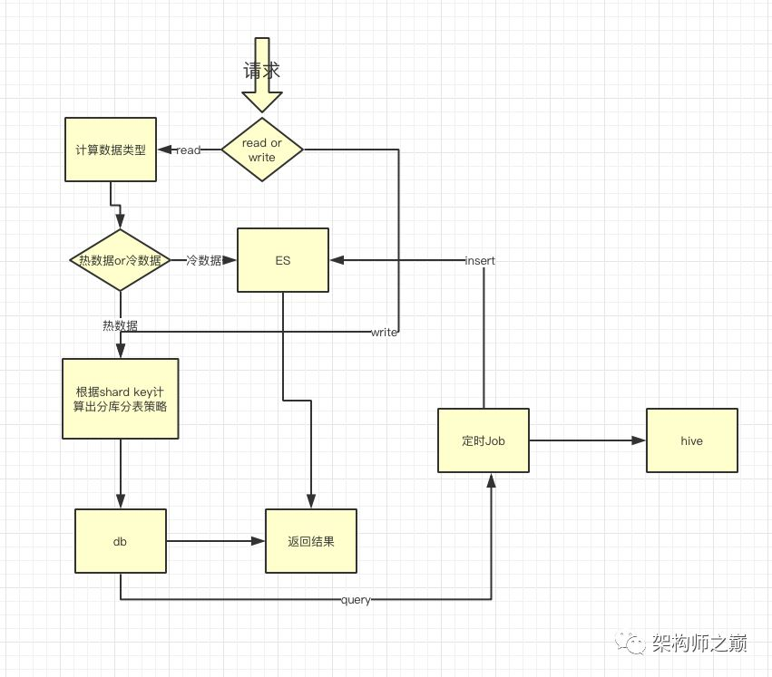
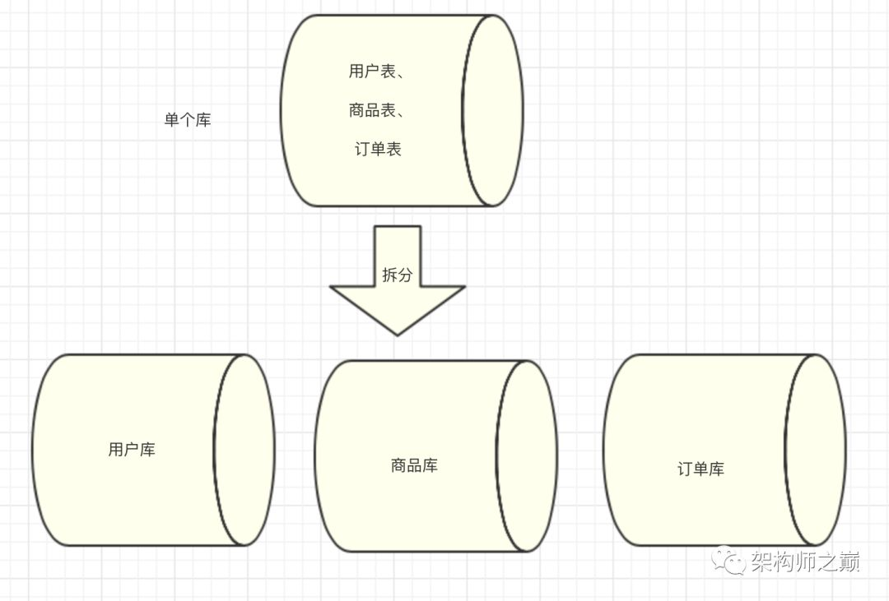
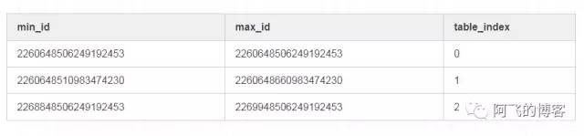
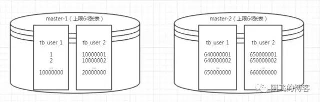
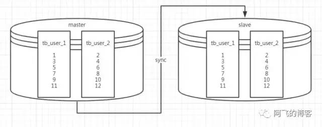
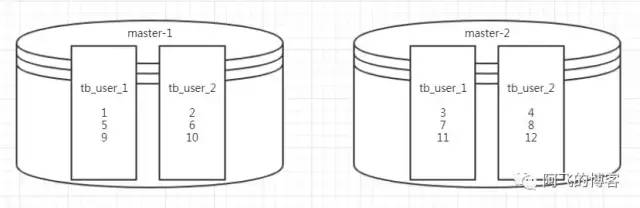

## 一. 分表时主要需要做的事情
* 在能满足业务场景的情况下，单表>分区>单库分表>分库分表，推荐优先级从左到右逐渐降低

1. 选定分片键：既然是用户表那分片键非用户ID莫属；
2. 修改代码：以sharding-jdbc这种client模式的中间件为例，主要是引入依赖，然后新增一些配置。业务代码并不怎么需要改动。
3. 存量数据迁移；【最麻烦，而且非常不好验证迁前后数据一致性（目前业界主流的迁移方案是存量数据迁移+利用binlog进行增量数据同步，待两边的数据持平后，将业务代码中的开关切到分表模式）】
4. 业务发展超过容量评估后需要开发和运维介入扩容；


## 二.整体架构设计

数据划分成两大类型：分别是热数据和冷数据。
可能这里有个疑惑为什么要将冷数据分成两类，因为根据实际场景需求，用户基本不会去查看1年前的数据，如果将这部分数据还存储在db中，那么成本会非常高，而且也不便于维护。另外如果真遇到有个别用户需要查看1年前的订单信息，可以让用户走离线数据查看。

热数据：
```
3个月内的订单数据，查询实时性较高。
使用mysql进行存储，当然需要分库分表。
```
冷数据A：
```
3个月 ~ 12个月前的订单数据，查询频率不高。
对于这类数据可以存储在ES中，利用搜索引擎的特性基本上也可以做到比较快的查询。
```
冷数据B：
```
1年前的订单数据，几乎不会查询，只有偶尔的查询需求。
对于这类不经常查询的数据，可以存放到hive中
```
但是随着业务的提升，将所有业务都放在一个库中已经变得越来越难以维护，因此我们建议，将不同业务放在不同的库中，如下图所示：

由图中我们可以看出，我们将不同的业务放到不同的库中，将原来所有压力由同一个库中分散到不同的库中，提升了系统的吞吐量。
### 1.用户ID递增的方案

#### 1. 自增ID

* 假设存量数据用户表的id最大值是960W，那么分表算法是这样的，表序号只需要根据user_id/10000000就能得到：

用户ID在范围[1, 10000000)中分到tbuser0中（需要将tbuser重命名为tbuser_0）；

用户ID在范围[10000000, 20000000)中分到tbuser1中；

用户ID在范围[20000000, 30000000)中分到tbuser2中；

用户ID在范围[30000000, 40000000)中分到tbuser3中；

以此类推。

* 如果你的tbuser本来就有自增主键，那这种方案就比较好。但是需要注意几点，由于用户ID是自增的，所以这个ID不能通过HTTP暴露出去，否则可以通过新注册一个用户后，就能得到你的真实用户数，这是比较危险的。其次，存量数据在单表中可以通过自增ID生成，但是当切换分表后，用户ID如果还是用自增生成，需要注意在创建新表时设置AUTOINCREMENT，例如创建表tbuser2时，设置AUTO_INCREMENT=10000000，DDL如下：
```
CREATE TABLE if not exists `tb_user_2` (	
  `id` int(11) unsigned NOT NULL AUTO_INCREMENT PRIMARY KEY,	
  `username` varchar(16) NOT NULL COMMENT '用户名',	
  `remark` varchar(16) NOT NULL COMMENT '备注'	
) ENGINE=InnoDB AUTO_INCREMENT=10000000;
这样的话，当新增用户时，用户ID就会从10000000开始，而不会与之前的用户ID冲突		
insert into tb_user_2 values(null, 'afei', 'afei');
```
-
#### 2. Redis incr

* 第二种方案就是利用Redis的incr命令。将之前最大的ID保存到Redis中，接下来新增用户的ID值都通过incr命令得到。然后insert到表tbuser中。这种方案需要注意Redis主从切换后，晋升为主的Redis节点中的ID可能由于同步时间差不是最新ID的问题。这样的话，可能会导致插入记录到tbuser失败。需要对这种异常特殊处理一下即可。

#### 3. 利用雪花算法生成

* 采用类雪花算法生成用户ID，这种方式不太好精确掌握切分表的时机。因为没有高效获取tbuser表数据量的办法，也就不知道什么时候表数据量达到1000w级别，也就不知道什么时候需要往新表中插入数据（select count(*) from tbuser无论怎么优化性能都不会很高，除非是MyISAM引擎）。而且如果利用雪花算法生成用户ID，那么还需要一张表保存用户ID和分表关系：


#### 4. 自定义算法生成
* 采用类雪花算法order_id生成规则如下，“商户所在地区号+时间戳+随机数”，我们可以根据时间戳计算出查询的是热数据还是冷数据

#### 通用ID策略推荐
推荐第一种方案，即利用表自增ID生成用户ID：方案越简单，可靠性越高。其他几种方案，或者其他方案或多或少需要引入一些中间件或者介质，从而增加方案的复杂度，当然具体业务需要具体对待。新方案效果图如下：




### 4.扩容
* 背景：现在已经有2张表：tbuser1，tbuser2。且有两个库是主备关系，并且分表算法是hash(user_id)%2：

```
现在要扩容到4张表，做法是将两个库的主从关系切断。然后slave晋升为master，这样就有两个主库：master-1，master-2。新的分表算法是：
    库选择算法为：hash(userid)%4的结果为1或者2，就选master-1库，hash(userid)%4的结果为3或者0，就选master-2库；
    表的选择算法为：hash(userid)%2的结果为1则选tbuser1表，hash(userid)%2的结果为0则选tbuser2表。
```
* 如此以来，两个库中总计4张表，都冗余了1倍的数据：master-1中tbuser1冗余了3、7、11…，master-1中tbuser2冗余了4、8、12…，master-2中tbuser1冗余了1、5、9…，master-2中tbuser2冗余了2、6、10…。将这些冗余数据删掉后，库、表、数据示意图如下所示：
