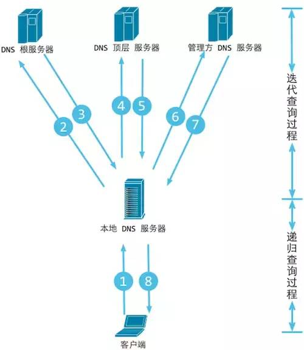
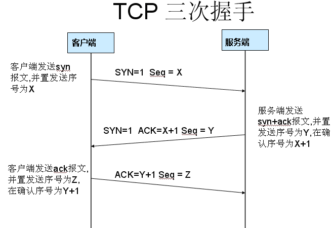
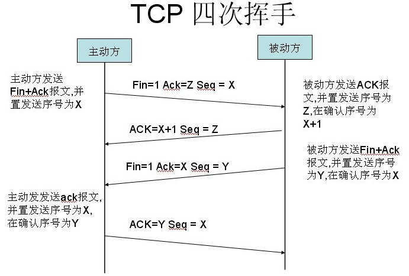

## 背景介绍
当我们在浏览器输入一个网址，然后按下回车，接下来浏览器显示了页面。
网速好的话这之间可能就一秒，但在这一秒内到底发生了什么？

其实这个问题很高级，包含的内容很多，囊括了网络、中间件、架构、业务细节等往深处说可以很底层，
是一个以点到面的问题，很考验技术人员知识的广度与深度。

这里我以之前实际开发过项目中的订单查询为例，说明下我们经常操作的订单查询会经历那些过程。

## 详细过程

* 用户在浏览器中输入URL地址-->DNS把域名解析成对应的IP地址

```
递归/迭代查询过程：
1、浏览器DNS缓存检查
2、操作系统缓存检查 + hosts 解析
3、本地区域名服务器(Local DNS Server)解析
4、根域名服务器解析(Root Server)解析
5、主域名服务器(gTLD Server)解析
```

* 根据这个IP地址在互联网上找到对应的服务器，建立Socket连接 --> TCP/IP三次握手
```
User-Agent（一般是指浏览器）会以一个随机端口（1024 < 端口 < 65535）向服务器的 WEB 程序发起 TCP 的连接请求
TCP/IP三次握手:
1.Client 首先发送一个连接试探，SYN = 1 表示这是一个连接请求或连接接受报文，同时表示这个数据报不能携带数据，
seq = x 表示 Client 自己的初始序号（seq = 0 就代表这是第 0 号包），这时候 Client 进入 syn_sent 状态，
表示客户端等待服务器的回复。

2.Server 监听到连接请求报文后，如同意建立连接，则向 Client 发送确认。报文中的 SYN 和 ACK 都置 1 ，
ACK = x + 1 表示期望收到对方下一个报文段的第一个数据字节序号是 x+1，同时表明 x 为止的所有数据都已正确收到
（ACK = 1 其实是 ACK = 0 + 1，也就是期望客户端的第 1 个包），seq = y 表示 Server 自己的初始序号（seq = 0
就代表这是服务器这边发出的第 0 号包）。这时服务器进入 syn_rcvd，表示服务器已经收到 Client 的连接请求，等待确认。

3.Client 收到确认后还需再次发送确认，同时携带要发送给 Server 的数据。ACK 置 1 表示确认号 ack= y + 1 有效（代表期望收到服务器的第 1 个包），
Client自己的序号 seq= x + 1（表示这就是我的第1个包，相对于第0个包来说的），一旦收到Client的确认之后，这个TCP连接就进入 Established 状态，
就可以发起请求了。
```

* 客户端向服务器发送HTTP协议请求包，请求服务器里的资源文档；
* 在服务器端，实际上还有复杂的业务逻辑：服务器可能有多台，到底指定哪台服务器处理请求，这需要一个负载均衡设备来平均分配所有用户的请求；
* 还有请求的数据是存储在分布式缓存里还是一个静态文件中，或是在数据库里；
* 当数据返回浏览器时，浏览器解析数据发现还有一些静态资源（如：css，js或者图片）时又会发起另外的请求，而这些请求可能会在CDN上，那么CDN服务器又会处理这个用户的请求。
* 客户端与服务器断开。由客户端解释HTML文档，在客户端屏幕上渲染图形结果。-->TCP/IP四次挥手
