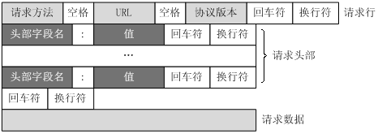
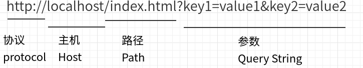
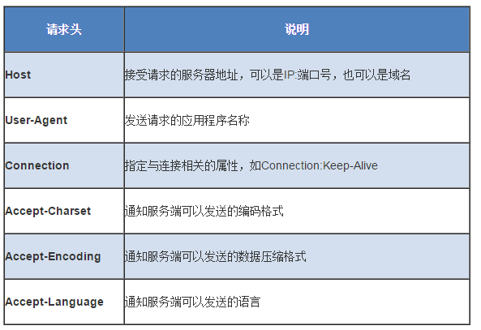
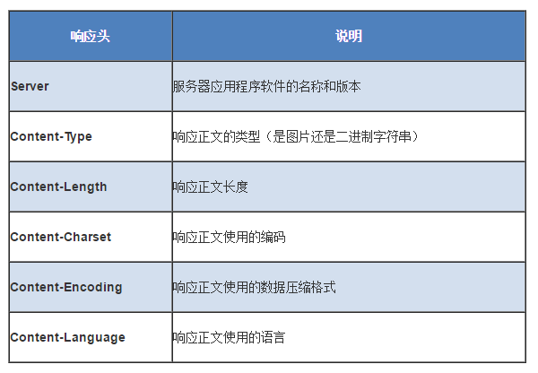
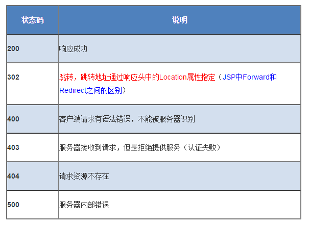
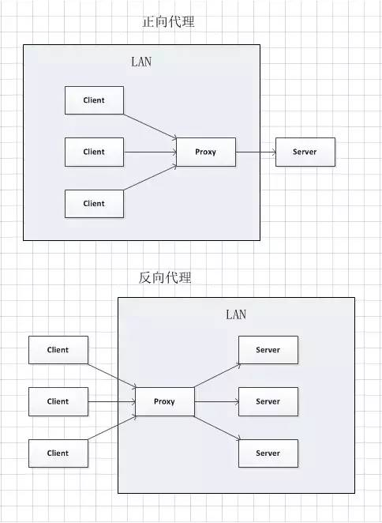

## 背景介绍
当我们在浏览器输入一个网址，然后按下回车，接下来浏览器显示了页面。
网速好的话这之间可能就一秒，但在这一秒内到底发生了什么？

其实这个问题很高级，包含的内容很多，囊括了网络、中间件、架构、业务细节等往深处说可以很底层，
是一个以点到面的问题，很考验技术人员知识的广度与深度。

这里我以之前实际开发过项目中的订单查询为例，说明下我们经常操作的订单查询会经历那些过程。

## 详细过程

### 1.用户在浏览器中输入URL地址
DNS把域名解析成对应的IP地址（解析没有过期的对应域名）

```
递归/迭代查询过程：
1、浏览器DNS缓存检查
2、操作系统缓存检查 + hosts 解析
3、本地区域名服务器(Local DNS Server)解析
4、根域名服务器解析(Root Server)解析
5、主域名服务器(gTLD Server)解析
```

### 根据这个IP地址在互联网上找到对应的服务器，建立Socket连接
* User-Agent（这里指的浏览器）会以一个随机端口（1024 < 端口 < 65535）向服务器的 WEB 程序发起 TCP 的连接请求

* TCP/IP三次握手:
1. Client 首先发送一个连接试探，SYN = 1 表示这是一个连接请求或连接接受报文，同时表示这个数据报不能携带数据，seq = x 表示 Client 自己的初始序号（seq = 0 就代表这是第 0 号包），这时候 Client 进入 syn_sent 状态，表示客户端等待服务器的回复。

2. Server 监听到连接请求报文后，如同意建立连接，则向 Client 发送确认。报文中的 SYN 和 ACK 都置 1 ，ACK = x + 1 表示期望收到对方下一个报文段的第一个数据字节序号是 x+1，同时表明 x 为止的所有数据都已正确收到（ACK = 1 其实是 ACK = 0 + 1，也就是期望客户端的第 1 个包），seq = y 表示 Server 自己的初始序号（seq = 0就代表这是服务器这边发出的第 0 号包）。这时服务器进入 syn_rcvd，表示服务器已经收到 Client 的连接请求，等待确认。

3. Client 收到确认后还需再次发送确认，同时携带要发送给 Server 的数据。ACK 置 1 表示确认号 ack= y + 1 有效（代表期望收到服务器的第 1 个包），Client自己的序号 seq= x + 1（表示这就是我的第1个包，相对于第0个包来说的），一旦收到Client的确认之后，这个TCP连接就进入 Established 状态，就可以发起请求了。


### 客户端向服务器发送HTTP协议请求包，请求服务器里的资源文档；
一个HTTP请求报文由请求行（request line）、请求头部（header）、空行和请求数据4个部分组成


请求行分为三个部分：请求方法、请求地址和协议版本

*　请求方法：GET、POST、PUT、DELETE、PATCH、HEAD、OPTIONS、TRACE。
*　请求地址：<协议>：//<主机>：<端口>/<路径>
端口和路径有时可以省略（HTTP默认端口号是80）

*　协议版本：HTTP/主版本号.次版本号，常用的有HTTP/1.0和HTTP/1.1

请求头部

请求头部为请求报文添加了一些附加信息，由“名/值”对组成，每行一对，名和值之间使用冒号分隔。
请求头部的最后会有一个空行，表示请求头部结束，接下来为请求数据，这一行非常重要，必不可少。


HTTP响应报文由状态行、响应头部、空行以及响应数据组成。


状态码

状态代码为3位数字。
* 1xx：指示信息--表示请求已接收，继续处理。
* 2xx：成功--表示请求已被成功接收、理解、接受。
* 3xx：重定向--要完成请求必须进行更进一步的操作。
* 4xx：客户端错误--请求有语法错误或请求无法实现。
* 5xx：服务器端错误--服务器未能实现合法的请求。


### 在服务器端网关与负载均衡

* 在服务器端实际上还有复杂的业务逻辑：服务器可能有多台，到底指定哪台服务器处理请求，这需要一个负载均衡设备来平均分配所有用户的请求；
Nginx网关负载均衡（在这里我们用的nginx做负载均衡原因是我们需要一个tcp/ip网关处理netty）

1、反向代理

反向代理（Reverse Proxy）方式是指：代理服务器来接受 Internet 上的连接请求，然后将请求转发给内部网络上的服务器，并将从内部网络上服务器得到的结果返回给 Internet 上请求连接的客户端。此时代理服务器对外就表现为一个服务器，反向代理服务器对于客户端而言它就像是原始服务器，并且客户端不需要进行任何特别的设置。

反向代理的作用：

保证内网的安全，可以使用反向代理提供 WAF 功能，阻止 web 攻击。

负载均衡，通过反向代理服务器来优化网站的负载。

2、正向代理

既然有反向代理，就肯定有正向代理。什么叫正向代理呢？

正向代理（Forward Proxy）通常都被简称为代理，就是在用户无法正常访问外部资源，可以通过代理的方式，让用户绕过防火墙，从而连接到目标网络或者服务。

正向代理的工作原理就像一个跳板。从网站的角度，只在代理服务器来取内容的时候有一次记录，有时候并不知道是用户的请求，也隐藏了用户的资料，这取决于代理告不告诉网站。

正向代理是一个位于客户端和原始服务器(origin server)之间的服务器。为了从原始服务器取得内容，客户端向代理发送一个请求并指定目标(原始服务器)，然后代理向原始服务器转交请求并将获得的内容返回给客户端。


### 还有请求的数据是存储在分布式缓存里还是一个静态文件中，或是在数据库里；

### 浏览器解析数据处理静态资源
* 当数据返回浏览器时，浏览器解析数据发现还有一些静态资源（如：css，js或者图片）时又会发起另外的请求，而这些请求可能会在CDN上，那么CDN服务器又会处理这个用户的请求。


### 客户端与服务器断开。由客户端解释HTML文档，在客户端屏幕上渲染图形结果。
* Http 请求报文头部信息，其中含有 Connection: keep-alive 意味着这次请求结束后不会关闭 TCP 连接。这样在频繁的创建连接，关闭连接的场景中节约资源。

* TCP/IP四次挥手：

由于TCP连接是全双工的，因此每个方向都必须单独进行关闭。这原则是当一方完成它的数据发送任务后就能发送一个 FIN 来终止这个方向的连接。收到一个 FIN 只意味着这一方向上没有数据流动，一个TCP连接在收到一个 FIN 后仍能发送数据。首先进行关闭的一方将执行主动关闭，而另一方执行被动关闭。
1. 主机1（可以使客户端，也可以是服务器端），设置Sequence Number，向主机2发送一个FIN报文段；此时，主机1进入FIN_WAIT_1状态；这表示主机1没有数据要发送给主机2了；

2. 主机2收到了主机1发送的FIN报文段，向主机1回一个ACK报文段，Acknowledgment Number为Sequence Number加1；主机1进入FIN_WAIT_2状态；主机2告诉主机1，我“同意”你的关闭请求；

3. 主机2向主机1发送FIN报文段，请求关闭连接，同时主机2进入LAST_ACK状态；

4. 主机1收到主机2发送的FIN报文段，向主机2发送ACK报文段，然后主机1进入TIME_WAIT状态；主机2收到主机1的ACK报文段以后，就关闭连接；此时，主机1等待2MSL后依然没有收到回复，则证明Server端已正常关闭，那好，主机1也可以关闭连接了。

